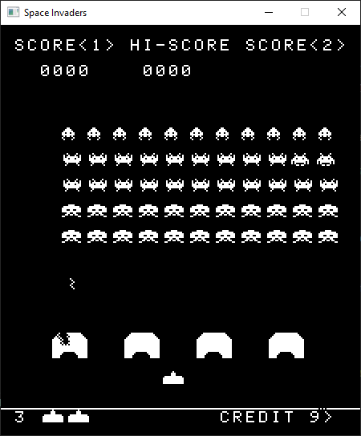
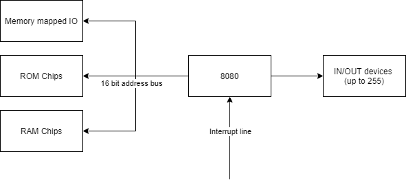

+++
title = "Experiments in 8080 static/jit compilation"
date = 2021-01-15T13:33:09Z
description = "An 8080 emulator JIT compiled into CLR IL"
draft = false
toc = false
summary = "Is it possible to recompile 8080 assembly into CLR IL? Can that be extended to deliver the Space Invaders arcade machine as a dynamically recompiled CLR binary?"
tags = ["emulation", "8080", "csharp", "clr"]
images = [
  "https://source.unsplash.com/collection/983219/1600x900"
] # overrides site-wide open graph image
[[copyright]]
  owner = "David Tyler"
  date = "2021"
  license = "cc-by-nc-sa-4.0"
+++

I've spent a lot of spare time over the last few years playing with emulating old computer architectures. I also spend my day job mentoring (and even occasionally writing) C#. 
This project combines those two areas of interest and asks the question: "Is it possible to recompile 8080 assembly into CLR IL"

Did it work? Yes! I have successfully built a [fully functional Space Invaders emulator with the 8080 cpu core purely implemented in IL](https://github.com/DaveTCode/8080JIT).



This blog post covers some of the details of what 8080 assembly looks like, what IL looks like, the process of mapping one to the other and also a fair bit of details about the complications involved.

## 8080 Architecture

To start we need an understand of what an 8080 actually _is_. Interally the 8080 is a processor with the 7 8 bit registers, 5 flags, a 16 bit stack pointer, and a 16 bit program counter.

| Registers       | Flags |
| --------------- | ----- |
| A (accumulator) | Carry flag (did the last result carry 255 + 1 = 0 w/carry 0-1=255 w/carry) |
| B               | Sign flag (was the result of the last operation twos complement negative?) |
| C               | Zero flag (was the result of the last operation zero?) |
| D               | Parity flag (did the last result have even [parity](https://en.wikipedia.org/wiki/Parity_flag) or odd parity?) |
| E               | Aux Carry flag (c.f. https://en.wikipedia.org/wiki/Adjust_flag) |
| H               | |
| L               | |

Externally, treated as a black box, it's quite a simple architecture with the following inputs & outputs:

1. A 16 bit address bus which can have lines hooked up to anything from raw memory, to memory mapped IO devices. 
    - That is, whilst the CPU can only reference addresses from 0x0000-0xFFFF there's no guarantees whatsoever that addresses refer to R/W memory. One could be hooked up to an LED and writing to it changes the color of the LED, the next could not be wired up at all etc.
2. Up to 255 IN/OUT ports which can be hooked up to any devices the designers selected (sound chips, serial ports, dedicated hardware for mathematical operations, etc)
3. A single interrupt line from which the external architecture can say "jump to start executing at address X" where X is one of a pre-defined set of 8 addresses



_Note: It's obviously a lot more complicated than that in detail, this high level view is sufficient for our emulation!_

### 8080 Assembly

With that context in mind we can look at what a simple piece of 8080 assembly code looks like both in textual form and in assembled bytes. The 8080 provides 255 different operations that it can perform. These generally characterise as:

- 8 bit arithmetic
    - e.g. ADI $ => register A = A + $ (the next byte) and set all the flags
    - CMP B => Check value of A - B and set all flags (but don't actually change A)
- 16 bit arithmetic
    - e.g. INX B => BC = BC + 1
- 8 bit load/store
    - e.g. LDA a16 => Get whatever is at memory address a16 and put it in A
    - MVI E,d8 => Put the next byte into E
- Jumps/Calls
    - e.g. JZ $addr => Jump immediately to the fixed 16 bit address $addr if and only if the zero flag is set
    - CNC $addr => Push next instruction to stack and then jump to $addr if and only if the carry flag is not set
    - RET => Return to the address referred to by the top two bytes of the stack
    - PCHL => Set the program counter to the value of the HL register pair (dynamic jump)
- Misc
    - e.g. NOP => Do nothing
    - HLT => Stop cpu

Code like this will get assembled from something like (taken from https://en.wikipedia.org/wiki/Intel_8080#Example_code):
```asm
            mov     a,b         ;Copy register B to register A
            ora     c           ;Bitwise OR of A and C into register A
            rz                  ;Return if the zero-flag is set high.
loop:       ldax    d           ;Load A from the address pointed by DE
            mov     m,a         ;Store A into the address pointed by HL
            inx     d           ;Increment DE
            inx     h           ;Increment HL
            dcx     b           ;Decrement BC   (does not affect Flags)
            mov     a,b         ;Copy B to A    (so as to compare BC with zero)
            ora     c           ;A = A | C      (set zero)
            jnz     loop        ;Jump to 'loop:' if the zero-flag is not set.   
            ret                 ;Return
```

to the bytes `78 B1 C8 1A 77 13 23 0B 78 B1 C2 03 10 C9` where the byte 0x78 literally means "MOV A,B" or "Move the value in register B into A".

So an emulators job is to take that stream of bytes and pretend to be the cpu by performing each operation in turn. A typical basic emulator of old 8 bit architectures would look like this:
```csharp
while (true)
{
  byte instruction = _memoryBus.ReadByte(_programCounter);
  _programCounter++;

  switch (instruction)
  {
    ...
    case 0x78: // MOV A, B
      _registers.A = _registers.B;
      break;
    ...
  }  
}
```

A lot less hard than it sounds! Some opcodes are naturally a bit more complex to write than that but that's the principle.

## CLR IL background

Ok, so that's the basics of an 8080, now lets take a look at the basic building blocks of the CLR IL and see where we can draw comparisons.

There are two major steps to get any dotnet application to actually run.

1. Compilation
2. Runtime JIT

When you write C# and do `dotnet build` the output is normally an intermediary format which is interpreted by the runtime. So what does that intermediate format look like? In steps [dotnet-ildasm](https://github.com/pjbgf/dotnet-ildasm)

Consider the following class
```csharp
class Emulator
    {
        private byte H;
        private byte L;

        private ushort HL
        {
            get => (ushort)((H << 8) | L);
            set
            {
                L = (byte)value;
                H = (byte)(value >> 8);
            }
        }
    }
```

Lets build it with `dotnet build` and then run `dotnet ildasm assembly.dll` to see what we get (I've removed everything except the get_HL method)

```asm
  .method private hidebysig specialname instance default uint16 get_HL() cil managed
  {
    // Method begins at Relative Virtual Address (RVA) 0x2050
    // Code size 17 (0x11)
    .maxstack 8
    IL_0000: ldarg.0
    IL_0001: ldfld byte TestILAddFields.Emulator::H
    IL_0006: ldc.i4.8
    IL_0007: shl
    IL_0008: ldarg.0
    IL_0009: ldfld byte TestILAddFields.Emulator::L
    IL_000e: or
    IL_000f: conv.u2
    IL_0010: ret
  } // End of method System.UInt16 TestILAddFields.Emulator::get_HL()
```

I reckon if you squint a bit then that doesn't look _miles_ different from the 8080 assembly in the previous section does it. Consider what it does with some commenting:

```asm
IL_0000: ldarg.0 // Load "this" so that the next variable can be loaded from the right class
IL_0001: ldfld byte TestILAddFields.Emulator::H // Load the value of H onto the stack
IL_0006: ldc.i4.8 // Load the value "8" onto the stack
IL_0007: shl // Take H back off the stack, take 8 off the stack, shift H left by 8 (H << 8 in the csharp code above) and then put the result back on the stack
```

So what are the big differences in architecture between this model and the 8080? Well, the crucial one is that the CLR uses a stack based execution model instead of registers. That is, if I want to add two numbers in 8080, I put one into A, one into another register (say C) and then call ADD C which puts the result back in A. If I want to add two numbers in CLR I push both onto the stack, call OpCodes.Add and then the result is back on the stack.

What else is different?
- The CLR doesn't have the concept of flags, whilst there are Beq (branch equal), Blt (branch less than) etc style operations there's no concept of carrying around persistent state about whether the last operation resulted in zero.
- The CLR doesn't have the notion of a program counter which can be directly affected by operations, that is, you can't dynamically at runtime say "now run instruction at address X" (where X is dynamically calculated)

## Implementation

OK, that's a crap ton of background to make sure we're all talking the same language. How did I take all of that and create an emulator?

### Step 1 - Dynamically construct a class which looks like the 8080 CPU

Here I have a single static function `CreateEmulator(byte[] rom)` which returns a dynamically created type shaped like this:

```csharp
class Cpu8080
{
  byte A, B, C, D, E, H, L;
  ushort StackPointer;
  bool Carry, Sign, Zero, Parity, AuxCarry;

  Run() {}
}
```

Internally that's done by making use of [AssemblyBuilder](https://docs.microsoft.com/en-us/dotnet/api/system.reflection.emit.assemblybuilder?view=net-5.0), [TypeBuilder](https://docs.microsoft.com/en-us/dotnet/api/system.reflection.emit.typebuilder?view=net-5.0) etc.

We'll deal with how the `Run` method was generated in a bit.


### Step 2 - Hook in all the external interfaces

What about memory access? Or access to arbitrary IN/OUT ports? Or providing hooks back so that the overarching computer can decide to render the screen?

For this I pass in interfaces to the various architectural interfaces. So there's an IMemoryBus which provides a `ReadByte` and `WriteByte` function that the CPU can call but is implemented by the calling code. Likewise for IN/OUT theres an IIOHandler with In & Out functions.

### Step 3 - Recompile the ROM to generate the Run function

The meat of the smarts here are in how we take the `byte[]` that corresponds to the ROM and turn it into C# IL. That process works as follows:

1. Create an ILGenerator for the Run method
2. Define labels for every instruction (so 0xFFFF labels corresponding to all the memory addresses)
3. Starting at 0x0000 looping until we've checked all possible addresses 
    - Decode the operation (is it NOP, LXI, JMP etc)
    - Emit the label corresponding to the current program counter (so we can jump to it as needed)
    - Emit equivalent IL for what that instruction is trying to do
    - Go to the next instruction (might not be adjacent if the operation consumed more than 1 byte)
4. Start the process in 3 again from the first "not yet seen" address until we've visited all addresses

Example (OUT instruction)
```csharp
methodIL.Emit(OpCodes.Ldarg_0);
methodIL.Emit(OpCodes.Ldfld, internals.IOHandlerField); // This is the IIOHandler field referring to some external object
methodIL.EmitLd8Immediate( _port);
methodIL.Emit(OpCodes.Ldarg_0);
methodIL.Emit(OpCodes.Ldfld, internals.A);
methodIL.Emit(OpCodes.Callvirt, internals.IOHandlerField.FieldType.GetMethod("Out")!); // Call Out(port, A) consuming port and A from the execution stack
```

So the output of this is a freaking _massive_ function with 0xFFFF labels, and on average ~10 IL instructions per 8080 instruction.

### Step 4 - Solve the problem of dynamic jumps

The above process is entirely sufficient to execute an 8080 in CLR IL EXCEPT for one major problem. Dynamic (runtime) jumps. This issue is mostly easily seen with the `PCHL` instruction. `PCHL` literally means "put the register pair HL into the program counter", or "jump to the address at HL".

There's no way to statically analyse a ROM and know where that will jump to. So we need to have some way, at runtime, of saying "Jump to the IL label with value = X".

I implemented this with a linear jump table placed at the front of the function. In pseudo code that is roughly:

1. Set destination address variable to HL
2. `OpCodes.Br JumpTableStart`

The jump table (which is statically generated) then looks like this:

1. Load destination address
2. Compare to 0x0000
3. OpCodes.Brtrue 0x0000

For every single possible opcode (0xFFFF of them). That's a pretty disgusting solution but I wasn't able to come up with anything better. Presumably an [OpCodes.Switch](https://docs.microsoft.com/en-us/dotnet/api/system.reflection.emit.opcodes.switch?view=net-5.0) would be better but it still suffers from the same issue of size bloat. Technically this could be implemented by a binary chop through the 0xFFFF space reducing from `O(n)` to `O(log(n))` complexity for each dynamic jump but that would increase the program size so I decided not to.

### Step 5 - Solve interrupts

The biggest hurdle to overcome in any static/jit compilation solution to emulation is synchronisation with external peripherals. For some systems that's particularly painful (to get full NES rom compatibility you'd need to synchronise every memory read/write!) but for the space invaders ROM we can get away with only synchronising on each instruction.

In an architectural sense what happens here is that any connected device can "notify" the CPU on the interrupt line and the CPU will (before the next instruction), clear that line and JMP to one of the RST addresses (0x00, 0x08, 0x10 etc) where it will continue operation.

To implement that in this recompilation we need to poll for that possible interrupt in between each instruction.

```csharp
methodIL.MarkLabel(cpuInternal.ProgramLabels[programCounter]);
                    
// Check for interrupts
interruptUtils.PostInstructionEmit(methodIL, cpuInternal, (ushort)programCounter);
```

So we delegate to the owning computer architecture, asking it to inject code into the method which will check for and handle interrupts.

In the case of space invaders, this piece of code will count down the number of cpu cycles and fire a half screen interrupt after 17066 cycles and a full screen interrupt after another 17066 cycles. [That code](https://github.com/DaveTCode/8080JIT/blob/master/SpaceInvadersJIT/SpaceInvadersInterruptUtils.cs#L21) is almost certainly the most complex of all the IL I emit and it needs to appear before every single entry instruction!

## Issues

On the whole this wasn't actually _that_ hard to implement. The single biggest issue is that you get exactly **no** help from the runtime at all if you've written bad IL. I definitely got sick of seeing `InvalidProgramException` by the end of the project!

Otherwise, the space invaders system is not hard to implement, the extra shift register hardware is trivial, the interrupts are regular and easy to understand and crucially the rendering pipeline is all of [20 lines of code](https://github.com/DaveTCode/8080JIT/blob/master/SpaceInvadersJIT/SpaceInvadersApplication.cs#L112) instead of the exceptionally complex Gameboy/Nes style PPU.

## Performance

Obviously there's absolutely NO point in doing this from a performance point of view. Even python running on cpython can cope with emulating an 8080 at full speed, however it's interesting to see what sort of performance it achieved.

Averaging the time taken for all but the first frame to render resulted in 382fps on a fairly powerful laptop...which is honestly not very impressive. You'd expect to be able to get well over 1000fps running an old system like this.

The more interesting performance note was that the actual invocation of the `Run` method delegate took over 1s before actually running any code. That's over 1s for the runtime to JIT my overly long function! That time notably increased when adding the interrupt handling so size of function (or possibly number of label markers) directly affects the JIT speed.