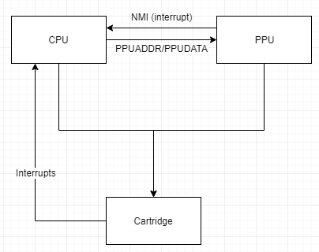
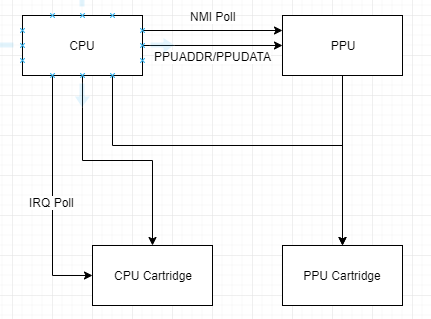
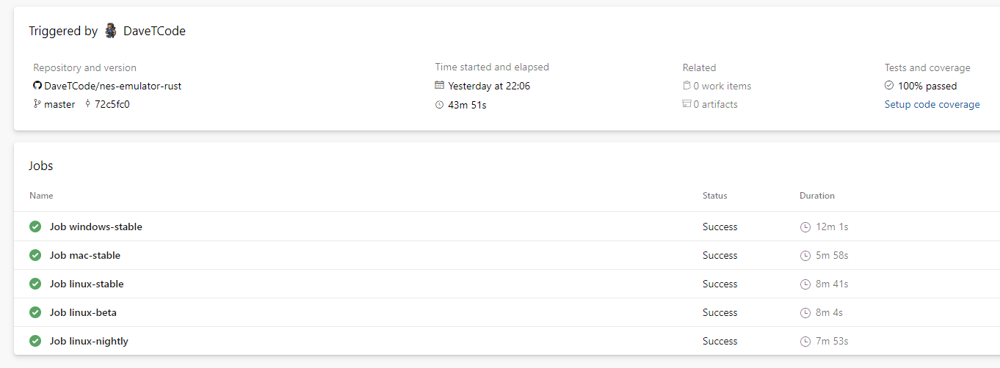

+++
title = "Nes Emulator in Rust"
date = 2020-12-10T10:09:51Z
description = "Nes Emulator in Rust with no unsafe code and only compile time guarantees."
draft = false
toc = true
tags = ["emulation", "rust"]
images = [
  "https://source.unsplash.com/collection/983219/1600x900"
] # overrides site-wide open graph image
[[copyright]]
  owner = "David Tyler"
  date = "2021"
  license = "cc-by-nc-sa-4.0"
+++

Over a period of 2 months in 2020 I intermittently worked on a NES emulator in rust to build a proper opinion of the language (and because it's fun). On the whole it was quite successful, https://github.com/DaveTCode/nes-emulator-rust now exists, has coverage of maybe 80% of the total ROM dumps out there, and passes almost all of the [test rom suite](https://wiki.nesdev.com/w/index.php/Emulator_tests).

All achieved with no `unsafe`, no `Rc`/`Refcell`, minimal heap allocations (we don't know how big a Rom is at compile time, it might be 8KB or 256KB) and a small handful of external crates.

This blog post is a write up of my feelings around rust as a language but probably provides some insights into writing an emulator along the way. I'm not claiming any level of expertise as a rust developer and only marginally more as an emulator developer!


<table>
  <tr>
    <td style="width:200px"></td>
    <td style="width:200px"></td>
    <td style="width:200px"></td>
    <td style="width:200px"></td>
    <td style="width:200px"></td>
  </tr>
 </table>

TL;DR
This is quite long. Broad summary was that I was pleasantly surprised with all the bits surrounding the language (tooling, IDE support etc) and I liked the WIBNI style language features I found but that my key takeaway was that moreso than other languages, you need more up front knowledge both of rust and the domain you're working in to produce high quality code. I don't know if that's controversial, you'll have to read on if you think I'm wrong!

## Language

### The good

There was an awful lot to like about rust as a core language, I've listed some of those that really stood out here but on the whole I almost never felt let down by writing code that would be more readable/beautiful if I only had feature X. The only really notable example is that https://doc.rust-lang.org/beta/unstable-book/language-features/generators.html in stable would have allowed me to write a CPU state machine with the language managing state instead of me doing it. That's fine, it's coming along in the future.

1. wrapping_add & saturating_add + panics when you over/underflow in non-release builds was an absolute life saver. Emulators of 8 bit computers spend a ton of time working with 8 bit integers (and 16 bit for some of the addresses), being forced to behave myself about when I want to wrap, saturate or not was really valuable. The extra overhead is a problem in an emulator but knowing I'll get a panic when I deliberately revert to explicit addition if I'm wrong about my invariants caught at least half a dozen bugs
e.g. https://github.com/DaveTCode/nes-emulator-rust/blob/master/src/cpu/mod.rs#L1031 is fine because I know that a DMA address will only ever run for 0xFF bytes, whereas https://github.com/DaveTCode/nes-emulator-rust/blob/master/src/cpu/mod.rs#L135 increments the PC by 1, which CAN wrap around the address space and so wrapping_add.
2. Match statements are as mature as anything I've seen and I massively abused them throughout
    - The below is just kinda gorgeous code compared to the if statement equivalent. Nothing particularly new to me coming from C# but most other modern languages don't have them and they are fuller featured here anyway,

    ```rust
    match address {  
        0x0000..=0x1FFF => self.ram[(address & 0x7FF) as usize],
        0x2000..=0x2007 => self.ppu.read_register(address),
        0x2008..=0x3FFF => self.ppu.read_register((address & 7) + 0x2000),
        0x4000..=0x4013 | 0x4015 => self.apu.read_byte(address), // APU registers
        0x4014 => 0x00, // TODO - Is this correct? We read 0 on the DMA register?
        0x4016..=0x4017 => self.io.read_byte(address), // Controller registers
        0x4018..=0x401F => 0x00, // TODO - Unused APU & IO registers
        0x4020..=0xFFFF => self.prg_address_bus.read_byte(address),
    }
    ```
    - I was a bit disappointed with if let matching and the inability to chain `if let Some(x) && x == something`, nice to have a couple of little pointless things to grumble about though.
3. Number formatting is honestly necessary in an emulator, deconstructing a value into bit fields with _ spaced sections is something I would get really annoyed without
    ```rust
    self.internal_registers.temp_vram_addr & 0b0000_0100_0001_1111
    ```
4. Macros seem really cool but I'm still scared of them after C. I made one standard (and quite nice) use in https://github.com/DaveTCode/nes-emulator-rust/blob/master/tests/test_roms.rs to construct parameterised tests but I feel like if I really got them then I could rewrite the CPU using macros instead of a state machine and the end result would have been more readable and most likely notably more performant.
5. Proper discriminated unions are something I've harped on at people about before (C# doesn't have them although F# does), I made pretty solid use of them in various bits of this emulator. Particularly for building a sprite fetch state machine but there's lots of other use cases as well:

    ```rust
    #[derive(Debug, Copy, Clone)]
    enum SpriteEvaluation {
      ReadY,
      WriteY { y: u8 },
      ReadByte { count: u8 },
      WriteByte { count: u8, value: u8 },
      Completed,
    }
    ```

### The unsure

Traits & structs vs interfaces & objects never really clicked with me but I think it's probably just a case of a paradigm shift that I haven't fully acclimatised to yet. The key example in a NES emulator is mappers. A front loading NES has a cartridge slot that you plug the game cartridge into, there are various address lines attached to it but basically it breaks down to two interfaces:

1. A 16bit wide address bus to the CPU
2. A 14bit wide addess bus to the PPU (side note, wouldn't it be great if languages could allow for arbitrary width integers with corresponding wrapping_add etc)

A natural way to model a cartridge in an inheritance & interface based language might be:

```rust
interface CpuAddressBus {
  read_byte(address: u16, cycle: CpuCycle) -> u8;
  write_byte(address: u16, value: u8, cycle: CpuCycle);
}
 
abstract class CpuCartridge : CpuAddressBus {
  rom: Vec<u8>;
 
  read_byte(address) ... blah
}
```

Then crucially, when you find that there's a mapper which blocks writes on consecutive cycles you can extend that base class with an extra field tracking last_write_cycle using inheritance and overwrite the write_byte function. My implementation of this in rust required a trait for the CpuAddressBus, a base structure and then composition to put that base structure into MyMapper, that means you awkwardly end up writing passthrough functions all over the place

```rust
fn read_byte(&mut self, address: u16, _: u32) -> u8 {
  self.base.read_byte(address)
}
```

which feels a bit crap.

The whole [mapper section of my code base](https://github.com/DaveTCode/nes-emulator-rust/tree/master/emulator/src/cartridge) is probably one of the key ones where I'd like a code review from an experienced rustacean, I'm not at all committed to this being a problem with the language. It smells much more like a problem with me!

### The bad(?)

I (wrongly) set out with the intention of building an emulator which didn't break out of the core rust safety model using runtime checks or unsafe blocks. As a consequence I spent a very long time trying to work out how to model an emulator in rust and I've ended up writing something in which data flow is far harder to reason about than I would have if I'd been allowed multiple mutable references & circular references.

Consider the following diagram showing some elements of the NES



Here the CPU needs mutable access to the cartridge (cartidge hosts RAM) and the PPU also needs mutable access to the cartridge. The CPU also needs mutable access to the PPU (set PPU data like palette information) but the PPU might trigger an NMI (non-maskable interrupt) to tell the CPU something. In my [gameboy emulator (C#)](https://github.com/DaveTCode/gameboy-emulator-dotnet) I can model this domain exactly as above, everything has mutable references to everything else (roughly) and whilst that is less robust to future developers making mistakes it's a closer model of the actual data domain in which I'm working.

In (safe, compile time checked) Rust the above has two key problems forcing me to create something a bit weird, less performant and harder to reason about:

1. The cartridge is owned by two objects (CPU & PPU both read/write to the cartridge)
    - This was almost fun, cartridges have multiple components so I split the cartridge into a `Box<dyn PpuAddressBus>` and a `Box<dyn CpuAddressBus>`. Unfortunately there's still some address lines which can mutate state on both. So very sadly I end up duplicating all writes from the CPU into both cartridge spaces (this isn't as big a perf deal as you'd think, 99.9% of the time the write is ignored on one or other cartridge) 
2. There are cycles between the CPU and components which fire interrupts (PPU, APU & Cartridge)
    - This was really ugly, I end up having to poll for interrupts from the CPU to each of the components, that in itself has probably caused literal days of pain handling subtle timing issues of when the poll occurs in relation to the write which caused the interrupt. All because I can't have a reference cycle.

The end result looks something like this:



What's my conclusion here? Is rust bad for my particular problem domain? Kind of yes and kind of no. A more experienced rust developer would have taken one look at the domain and said "yep, I need to use `Rc<RefCell<>>`" and not even tried to do what I did. I didn't feel qualified to make that call at the start and crucially it would be a collosal PITA to refactor the whole domain at a late point in the project. In another language you would have expected to model the domain exactly and if you got it wrong you'd have been in a much better place to reorganise your code.

I think what that really drove home for me is that architecting code in rust is notably harder than architecting it in another language, your choices are more limited, you will quite easily dig yourself a hole you can't easily get out of (I nearly threw the whole thing away when I realised that Cartridges could fire IRQs (they only can on certain "mappers" so it was quite late into the project that I noticed)). Maybe this is controversial?

## Development Environment

### Tooling

The overall tooling for rust is obviously absolutely incredible, I don't care which language you come from there's nothing out there that can beat it. rustfmt, clippy, cargo bench, workspaces, cargo flamegraph, dependabot support etc etc. With the notable exception of code coverage there was really nothing that I felt like I was missing and crucially none of it was utterly bollocks unlike certain other languages. The documentation on how to use various features was excellent as well.

Good job everyone involved in making rust not annoying to work with!

### IDE/Debugger

I exclusively work in windows and have a very strong preference for a development environment with interactive debugger, integrated test results, one click to run various different invocations of the program etc. I started off with vscode but found the code completion and debugging support in Windows to be atrocious (failed to start sometimes, hit errors other times, breakpoints didn't work intermittently, ability to inspect state on a breakpoint was flaky) so switched to CLion (Jetbrains C++ IDE with rust support). Fortunately that was excellent, paired with the visual studio toolchain and bundled LLDB I got something quite similar to the IDE experience I'm used to writing python/C#/java. Clippy warnings and proposed fixes inline, rustfmt on save, automatic macro expansion, step through debugging with variable inspection. 

I did have some issues after migrating the application into workspaces, occasional hangs whilst running background analysis processes and some fun guessing how to tell CLion what the invocation is to debug a binary but nothing insurmountable.

<table>
  <tr>
    <td style="width:50%"></td>
    <td style="width:50%"></td>
  </tr>
</table>

### Profiling

Another thing I thought I would miss from visual studio c# coding was profiling tools, the profiling tools for dotnet are absolutely first class and I was expecting to run into the "oh, just use this arcane C thing but make sure you have the right symbols loaded and you're using this exact version of blah". Fortunately not true (smile). I was unable to cargo flamegraph due to dtrace requirements (c.f. https://techcommunity.microsoft.com/t5/Windows-Kernel-Internals/DTrace-on-Windows/ba-p/362902 - it's coming but only insider builds of windows at the moment). However, because I was building for windows with the toolchain stable-x86_64-pc-windows-msvc I was able to attached visual studio to the process and get a really nice output like I'd expect.

<table>
  <tr>
    <td style="width:50%; height: 250px"></td>
    <td style="width:50%; height: 250px"></td>
  </tr>
</table>

Enough to fix my stupid "oh yeah, constructing strings for logging is expensive I remember" issue at any rate (wink)

### CI/CD

Emulators are incredibly finicky beasts, tweaking things to fix one issue will often break several tests that relied on precise timings elsewhere. So automated testing is basically a necessity. I wasn't sure what sort of support I'd get in Azure DevOps for rust but I was at least able to get it building on nightly, mac, windows and linux on each commit along with parsing test results. I normally like to get code coverage stats as well but it seemed less trivial than I'd hoped and I haven't yet got around to it. Definitely not insurmountable and I've seen posts floating that suggest this'll be trivial in the future.



I found https://github.com/crate-ci/azure-pipelines after writing my pipeline based on blog articles and it looks to be a much more comprehensive set of ideas. So nobody should be looking at what I did for ideas, just noting that a beginner in both ADO and rust was able to get up and running with minimal fuss!

## Conclusion

**"Rust restricts how you model your domain, and I'm not sure that's necessarily a good thing"**

A good principle to remember when considering coding arguments is "my problems are not necessarily your problems". I think all senior engineers understand this at some point. When you find yourself inclined to argue about coding issues: "unit tests vs integration tests", "dynamic vs static typing", "short functions vs long function" or any other absurd thing that you can bait people with then I think this is a great mantra to remember. Not all domains are equal, someone working on websites has a very different outlook to someone writing FPGA code to someone writing games. Typically similar problems exist in all these environments but the value functions applied to determine how and whether to solve them are different.

8 bit Emulators as a domain are quite interesting, they require no(ish) dynamically allocated memory, have very stringent performance requirements whilst being incredibly poorly suited to concurrency and have an exceptionally well defined end point. So taking as an example, Rust cares very deeply about data ownership which helps make sure that concurrent code is safe. Great! "Your problems are not my problems". 

So most of rusts restrictiveness of structure is unnecessary in an emulator environment. Therefore, when it encourages a poor domain model it feels like a bad trade off. Now, that said, it's clear that the correct domain model is viable if you know how to make proper use of https://doc.rust-lang.org/1.15.1/book/choosing-your-guarantees.html. So my real conclusion is that rust forces an up front decision which only experienced rust developers who fully understand the domain they're about to model can get right. 